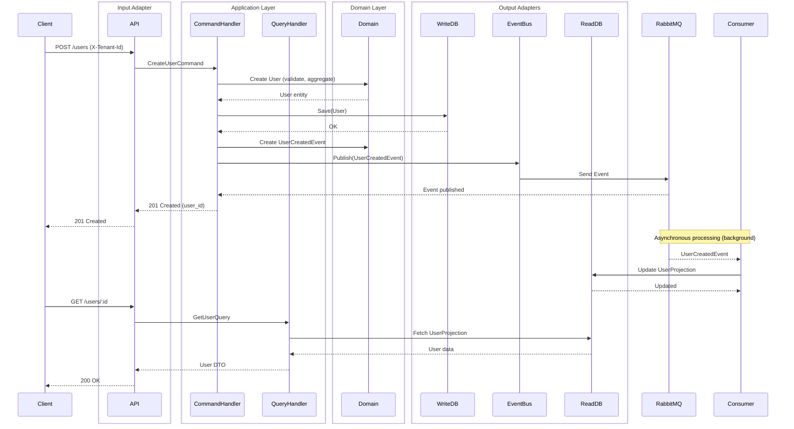

# Backend Hexagonal + CQRS con Go y Fiber

Backend moderno implementando **Arquitectura Hexagonal** y **CQRS** con soporte multi-tenant, idempotencia y proyecciones basadas en eventos.

## 📂 Estructura del Proyecto

```txt
go-hexagonal/
├── cmd/                          # Entry points
│   ├── api/main.go              # Servidor API REST
│   └── consumer/main.go         # Consumidor RabbitMQ
├── internal/
│   ├── bootstrap/               # Inicialización de la app
│   │   └── app.go
│   │   └── dependencies.go
│   ├── contexts/                # Bounded contexts
│   │   ├── users/
│   │   │   ├── domain/         # Lógica de negocio
│   │   │   │   ├── entities/
│   │   │   │   ├── value_objects/
│   │   │   │   ├── events/
│   │   │   │   ├── exceptions/
│   │   │   │   └── ports/
│   │   │   ├── application/    # Casos de uso
│   │   │   │   ├── commands/
│   │   │   │   ├── queries/
│   │   │   │   └── projections/
│   │   │   └── infrastructure/ # Adaptadores
│   │   │       ├── persistence/
│   │   │       ├── http/
│   │   │       └── messaging/
│   │   └── auth/               # Otro contexto
│   └── shared/                 # Código compartido
│       ├── domain/
│       ├── application/
│       └── infrastructure/
│           ├── rabbitmq/
│           ├── config/
│           ├── security/
│           ├── persistence/
│           └── middleware/
├── docs/                       # ADRs y documentación
├── docker-compose.yml
├── Dockerfile
├── Makefile
└── README.md
```

## 🏗️ Arquitectura

Este proyecto sigue los principios de:

- **Arquitectura Hexagonal**: Dominio independiente de infraestructura
- **CQRS**: Separación de comandos (escritura) y consultas (lectura)
- **Event-Driven**: Comunicación mediante eventos de dominio
- **Multi-tenancy**: Soporte de múltiples inquilinos
- **Bundle Contexts**: Módulos independientes y escalables

## 📦 Tecnologías

- **Go 1.21+**
- **Fiber**: Framework web
- **GORM**: ORM para PostgreSQL
- **PostgreSQL**: Base de datos
- **RabbitMQ**: Message broker
- **Docker & Docker Compose**: Containerización
- **Zap**: Logging estructurado
- **Viper**: Gestión de configuración

## 🚀 Quick Start

### Prerrequisitos

- Docker & Docker Compose
- Make

### Ejecutar aplicación

```bash
git clone git@github.com:carlosCACB333/go-hexagonal.git
cd go-hexagonal
cp .env.template .env
make up
```

## 🧪 Testing

```bash
make test-docker 
# o 
make test

## Cobertura de código
make coverage-docker 
# o
make coverage

```

### Usuarios

#### Crear Usuario (Comando)

```bash
POST http://localhost:8080/api/v1/users
Headers:
  X-Tenant-Id: tenant-123
  X-Idempotency-Key: unique-key-456
  X-Correlation-Id: corr-id-789
  Content-Type: application/json

Body:
{
  "name": "Juan Pérez",
  "email": "juan@example.com",
  "password": "SecurePass123",
  "display_name": "Juanito"
}

Response: 201 Created
{
  "user_id": "550e8400-e29b-41d4-a716-446655440000",
  "message": "User created successfully"
}
```

#### Obtener Usuario (Query)

```bash
GET http://localhost:8080/api/v1/users/{user_id}
Headers:
  X-Tenant-Id: tenant-123
  X-Correlation-Id: corr-id-789


Response: 200 OK
{
  "id": "550e8400-e29b-41d4-a716-446655440000",
  "tenant_id": "tenant-123",
  "name": "Juan Pérez",
  "email": "juan@example.com",
  "display_name": "Juanito",
  "created_at": "2024-01-15T10:30:00Z"
}
```

## 🔄 Flujo CQRS



## 🎯 Características Implementadas

### ✅ Arquitectura Hexagonal

- Dominio independiente de frameworks
- Puertos e interfaces bien definidos
- Adaptadores para infraestructura
- Inyección de dependencias centralizada

### ✅ CQRS

- Separación estricta entre comandos y consultas
- Write model: tabla `users`
- Read model: tabla `users_read`
- Proyecciones actualizadas por eventos

### ✅ Event-Driven

- Eventos de dominio (`UserCreatedEvent`)
- RabbitMQ como message broker
- Consumidor asíncrono para proyecciones
- Correlation ID para trazabilidad

### ✅ Multi-tenancy

- Header `X-Tenant-Id` requerido
- Scope por tenant en todas las operaciones
- Datos aislados por tenant

### ✅ Idempotencia

- Header `X-Idempotency-Key` opcional
- Previene duplicación de comandos
- Tabla `idempotency_keys` para tracking

### ✅ Rate Limiting

- Límite por tenant
- Configurable por endpoint
- 10 requests/minuto por defecto en creación

### ✅ Feature Flags

- Soporte de features opcionales por tenant
- Ejemplo: campo `display_name`

### ✅ Validaciones de Dominio

- Email válido con regex
- Password con política: min 8 chars, uppercase, lowercase, digit
- Email único por tenant

## 🔧 Comandos Make

```bash
make up              # Levantar aplicacion
make down            # Bajar contenedores
make test            # Ejecutar tests
make test-docker     # Ejecutar tests dentro de contenedor
make coverage        # Cobertura de tests
make coverage-docker # Cobertura de tests dentro de contenedor
make clean           # Limpiar todo
```

## 📊 Monitoring

### Logs Estructurados (JSON)

Todos los logs se generan en formato JSON con:

- `timestamp`
- `level` (info, error, debug)
- `message`
- `tenant_id`
- `correlation_id`
- Metadata adicional

### Health Checks

```bash
# Health check básico
GET http://localhost:8080/health

# Verifacion a recursos criticos
GET http://localhost:8080/ready
```

### RabbitMQ Management

Acceder a: <http://localhost:15672>

- Usuario: `guest`
- Password: `guest`

## 🗄️ Base de Datos

### Write Model (users)

Tabla optimizada para escritura con todas las columnas necesarias.

### Read Model (users_read)

Tabla denormalizada optimizada para queries rápidas.

### Idempotency Keys

Tabla para tracking de comandos procesados con cleanup automático.

### GORM como ORM

Este proyecto usa **GORM** como ORM, ofreciendo:

- **Type-safe queries**: Queries con verificación de tipos en compilación
- **Auto-migrations** (opcional): Para desarrollo rápido
- **Hooks**: BeforeCreate, AfterCreate, etc.
- **Associations**: Manejo de relaciones
- **Transaction support**: Transacciones ACID
- **Connection pooling**: Gestión de pool de conexiones

#### Modelos GORM

```go
// Write Model
type UserModel struct {
    ID          uuid.UUID  `gorm:"type:uuid;primaryKey"`
    TenantID    string     `gorm:"type:varchar(100);not null;index"`
    Name        string     `gorm:"type:varchar(255);not null"`
    Email       string     `gorm:"type:varchar(255);not null;uniqueIndex"`
    Password    string     `gorm:"type:varchar(255);not null"`
    DisplayName *string    `gorm:"type:varchar(255)"`
    CreatedAt   time.Time  `gorm:"autoCreateTime"`
    UpdatedAt   time.Time  `gorm:"autoUpdateTime"`
}
```

## 🔐 Seguridad

- Contraseñas hasheadas con bcrypt
- Validaciones estrictas en dominio
- Rate limiting por tenant
- CORS habilitado
- Headers de seguridad

## 📚 ADRs (Architecture Decision Records)

Ver `/docs` para ADRs detallados:

- ADR-001: Elección de Arquitectura Hexagonal
- ADR-002: Implementación de CQRS
- ADR-003: Estrategia Multi-tenancy
- ADR-004: Idempotencia mediante Idempotency Keys
